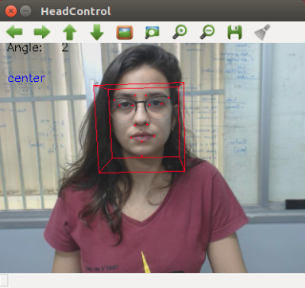

#  Face Orientation
## Descrição
Identificação da orientação do rosto do usuário e o seu ângulo em relação à câmera.  O algoritmo utiliza a biblioteca dlib em conjunto com openCV para detectar pontos de referência na face em uma imagem.  Os pontos utilizados são: **18, 22, 23, 27, 37, 40, 43, 46, 32, 36, 49, 55, 58, 9**.

Os testes foram realizados utilizando a câmera  [c295e](https://www.logitech.com/pt-br/products/webcams/c925e-business-webcam.960-001075.html) da *Logitech*.

## Instalação
Para que o algoritmo seja executado com sucesso, é necessário instalar a biblioteca dlib ([tutorial dlib](https://www.pyimagesearch.com/2017/03/27/how-to-install-dlib/)) e o opencv2.
>pip install opencv-python

É necessário também fazer o download do pacote [usb_cam](http://wiki.ros.org/usb_cam) para ROS kinetic.

## Como utilizar
O repositório é dividido em:
* **config**: diretório onde se encontra o arquivo com alguns parâmetros que podem ser modificados.
* **launch**: neste diretório estão três arquivos .launch. 
	* *face_orientation*: Utilizado quando o nó do usb_cam já está sendo executado e executa apenas o algoritmo de orientação da face.
	* *usb_cam_and_face_orientation*: Primeiro ele executa o usb_cam e depois o algoritmo de orientação da face.
	* *usb_cam_node*: Executa apenas o nó do usb_cam.
* **scripts**: O script em python  responsável pelo reconhecimento da orientação da face.

Após esse comando (ou alguma combinação dos arquivos ".launch" ja mencionados),
>roslaunch face_orientation usb_cam_and_face_orientation.launch

o tópico pos_head_topic, *message type String*, é publicado com a orientação do rosto e o ângulo em relação à câmera.

Nas imagens abaixo, é possível ver os pontos de referência da imagem, a orientação da face e o ângulo.

